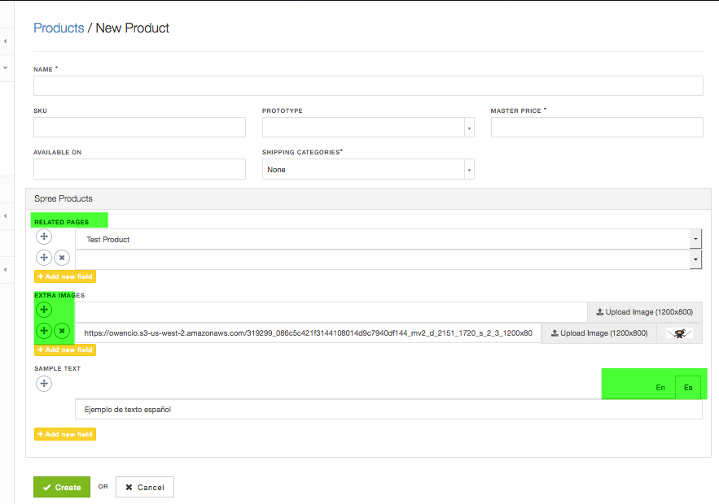

# Camaleon CMS - Spree 
Camaleon CMS - Spree is a plugin of Camaleon CMS to add Camaleon CMS into Spree CMS

This plugin permit you to add custom fields for Spree Products by simple Drag and Drop, add custom fields for Camaleon Contents using Spree Products and Categories, also permits to manage your menus from Camaleon CMS.
## Installation
* Install Spree   
    If there is an error creating admin user: please do this:
    ```
    rake spree_auth:admin:create
    ```
* Install Camaleon CMS '>= 2.4.3'
* Edit Camaleon CMS Settings config/system.json
 ```
 "user_model": "Spree::User",
 "admin_path_name": "store_admin",
 ```
* Edit Gemfile
```
gem 'camaleon_spree'
```
* Copy private file private_helper.rb to app/helpers/plugins/camaleon_spree/private_helper.rb
* Gem installation
```
bundle install
rake db:migrate
```
* Restart Server
* Complete Camaleon CMS Installation by visiting: http://localhost:3000/store_admin
* Active your plugin in store_admin -> plugins
* Configure your camaleon layout in plugin settings (optional), default use spree layout for camaleon pages
* Create your custom fields for Spree Products or Camaleon Pages
* Enjoy!

## Features
* Create custom fields for Spree Products, sample: related pages.
* Spree Products and Categories as Custom fields to use in Camaleon CMS Pages, sample: related products.
* Spree Products/Categories available in Camaleon CMS menus editor
* Manage Store Menus by Camaleon CMS

## Extras
* Sample template for Spree Page using related products: [template_product_page.html.erb](app/views/plugins/camaleon_spree/examples/template_product_page.html.erb)
  Copy inside your [camaleon current theme folder]/theme/views/template_product_page.html.erb and assign it in page edit form.
* Sample frontend show product custom fields [_product_custom_fields.html.erb](app/views/plugins/camaleon_spree/examples/_product_custom_fields.html.erb)
  Copy inside your app/views/defaces/product_custom_fields.html.erb and create a deface for Spree, like:    
  ```
  Deface::Override.new(
        virtual_path: 'spree/products/show',
        name: 'cama_product_view_custom_fields',
        insert_bottom: '[data-hook="product_taxons"]',
        partial: 'defaces/product_custom_fields'
    )
  ```
* Add Camaleon CMS Menus in Spree Layout (Download sample template [here](app/views/plugins/camaleon_spree/examples/_layout_menus.html.erb) and copy to app/views/defaces/_layout_menus.html.erb)
  ```
  Deface::Override.new(
        virtual_path: 'spree/layouts/spree_application',
        name: 'cama_menus_in_spree',
        insert_top: '[data-hook="body"]',
        partial: 'defaces/layout_menus'
    )
  ```
* Demonstration:    
http://spree.tuzitio.com/   
    - Admin User: owenperedo@gmail.com | 12345678
        
* More information here:   
http://camaleon.tuzitio.com/store/plugins/camaleon-spree